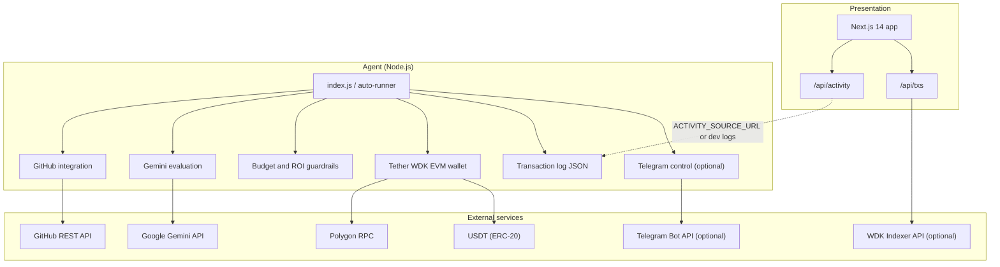

# ClawTipper

Autonomous agent that evaluates merged GitHub pull requests under explicit economic rules and settles tips in **USDT** on **Polygon** using **Tether WDK**. The agent wallet is **self-custodial**; policy limits (balances, per-tip caps, ROI thresholds, rejection paths) are enforced before any transfer.

## Architecture



## Overview

| Area | Description |
|------|-------------|
| **Objective** | Encode reward policy in software and execute payouts on-chain without manual invoicing for each contribution. |
| **Stack** | Tether WDK, Google Gemini (configurable model), Next.js 14, Polygon USDT; optional Telegram for operator notifications and controls. |
| **Controls** | Self-custodial mnemonic; minimum balance, maximum tip, daily percentage cap, ROI floor, and hard gates for trivial or invalid inputs. |
| **Commercial model** | Configurable platform fee on tips for pool-funded or B2B incentive programs. |

## Proof of settlement

After a successful live run, record the transaction here:

`https://polygonscan.com/tx/<YOUR_TX_HASH>`

Generate by funding the agent wallet, including a contributor `0x` address in the PR body, running the agent without `--dry-run`, and copying the returned hash from the console.

## Repository layout

| Path | Role |
|------|------|
| `clawtipper/` | Agent: GitHub fetch, LLM evaluation, WDK transfers, logging, optional Telegram and polling (`auto-runner`). |
| `clawtipper-web/` | Web application: dashboard, activity feed, optional WDK Indexer-backed transaction view. |

## Agent

```bash
cd clawtipper
cp .env.example .env
npm install
npm run agent:dry
# Or single PR:
# node index.js "<PR_URL>" "0x..." --dry-run
# node index.js "<PR_URL>" "0x..."
```

## Web application

```bash
cd clawtipper-web
cp .env.example .env.local
npm install
npm run dev
```

## Deploy (Vercel + agent)

### Next.js on Vercel

1. Import the GitHub repo in [Vercel](https://vercel.com).
2. **Root Directory:** `clawtipper-web` (monorepo).
3. Framework: Next.js (auto). Build: `npm run build`, Output: default.
4. **Environment variables** (Production and Preview as needed):

   | Variable | Notes |
   |----------|--------|
   | `NEXT_PUBLIC_SITE_URL` | `https://<your-project>.vercel.app` (or custom domain). |
   | `NEXT_PUBLIC_GITHUB_REPO` | Your public repo URL. |
   | `ACTIVITY_SOURCE_URL` | **Required for live feed on Vercel** — HTTPS URL to raw `transactions.json` (e.g. Gist raw). Serverless has no access to `clawtipper/logs` on your laptop. |
   | `WDK_INDEXER_API_KEY` | Optional; enables `/api/txs` on-chain card. |
   | `AGENT_WALLET_ADDRESS` | Same `0x` as agent wallet (mnemonic account 0). |
   | `ALLOW_ACTIVITY_DEMO` | Leave **unset** in production; optional local preview only. |

5. Redeploy after changing env vars.

### Agent (not Vercel)

The tipping agent is a **Node** service (CLI, optional `auto-runner`, Telegram). Run it on **Render**, **Railway**, **Fly.io**, a VPS, or locally — with `clawtipper/.env`. Sync or publish `clawtipper/logs/transactions.json` to the same URL as `ACTIVITY_SOURCE_URL` so the Vercel site shows new tips.

Omit `ALLOW_ACTIVITY_DEMO` in production. See `clawtipper-web/.env.example` for web env vars.

## Operations notes

- Run a single agent process against Telegram to avoid session conflicts (e.g. HTTP 409).
- Confirm GitHub API authentication before batch runs (`GITHUB_TOKEN` / token check in logs).
- Align `PROVIDER_URL` and `USDT_ADDRESS` with the same Polygon network (mainnet vs testnet).
- Transfers retry only on transport/RPC errors before a hash is returned, then the agent waits for a successful receipt (tunable via `WDK_TX_*` in `clawtipper/.env.example`).

## Demonstration narrative

**Three-line explanation:** Open source produces value without a standard way to settle rewards in money. ClawTipper is an agent that scores merged pull requests under explicit economic rules and pays USDT through Tether WDK on Polygon. Guardrails plus an auditable chain record make this programmable incentive design, not a simple notification bot.

**If the network is slow:** As soon as the transaction is broadcast, the console prints the hash; open Polygonscan with that hash while the process finishes confirmation.

**Closing line:** This is constrained capital allocation: policy encoded in software, execution settled on-chain, with treasury-style limits on every payout.
