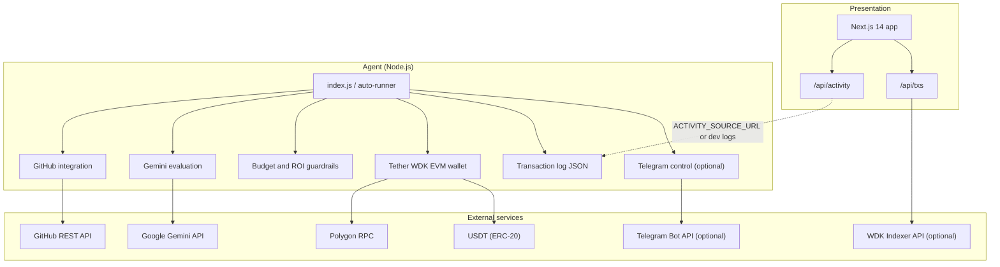

# ClawTipper

Autonomous agent that evaluates merged GitHub pull requests under explicit economic rules and settles tips in **USDT** on **Polygon** using **Tether WDK**. The agent wallet is **self-custodial**; policy limits (balances, per-tip caps, ROI thresholds, rejection paths) are enforced before any transfer.

## Architecture



## Overview

| Area | Description |
|------|-------------|
| **Objective** | Encode reward policy in software and execute payouts on-chain without manual invoicing for each contribution. |
| **Stack** | Tether WDK, Google Gemini (configurable model), Next.js 14, Polygon USDT; optional Telegram for operator notifications and controls. |
| **Controls** | Self-custodial mnemonic; minimum balance, maximum tip, daily percentage cap, ROI floor, and hard gates for trivial or invalid inputs. |
| **Commercial model** | Configurable platform fee on tips for pool-funded or B2B incentive programs. |

## Proof of settlement

After a successful live run, record the transaction here:

`https://polygonscan.com/tx/<YOUR_TX_HASH>`

Generate by funding the agent wallet, including a contributor `0x` address in the PR body, running the agent without `--dry-run`, and copying the returned hash from the console.

## Repository layout

| Path | Role |
|------|------|
| `clawtipper/` | Agent: GitHub fetch, LLM evaluation, WDK transfers, logging, optional Telegram and polling (`auto-runner`). |
| `clawtipper-web/` | Web application: dashboard, activity feed, optional WDK Indexer-backed transaction view. |

## Agent

```bash
cd clawtipper
cp .env.example .env
npm install
npm run agent:dry
# Or single PR:
# node index.js "<PR_URL>" "0x..." --dry-run
# node index.js "<PR_URL>" "0x..."
```

## Web application

```bash
cd clawtipper-web
cp .env.example .env.local
npm install
npm run dev
```

**Activity feed:** Set `ACTIVITY_SOURCE_URL` to a public URL returning the same shape as the agent transaction log JSON so production shows live rows. In development, the API can read `clawtipper/logs/transactions.json` when paths align.

**Default behavior:** Omit `ALLOW_ACTIVITY_DEMO` in production. The activity API then serves real sources only (remote URL or logs). Set `ALLOW_ACTIVITY_DEMO=true` only for local demonstration with seeded data and client-side simulation.

**WDK Indexer (optional):** Set `WDK_INDEXER_API_KEY` and `AGENT_WALLET_ADDRESS` in `clawtipper-web` to populate `/api/txs` with outbound USDT activity for the agent address. See `clawtipper-web/.env.example`.

## Operations notes

- Run a single agent process against Telegram to avoid session conflicts (e.g. HTTP 409).
- Confirm GitHub API authentication before batch or demo runs (`GITHUB_TOKEN` / token check in logs).
- Align `PROVIDER_URL` and `USDT_ADDRESS` with the same Polygon network (mainnet vs testnet).
